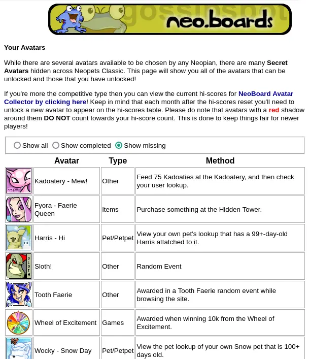

# Better avatar checklist

I am not affiliated with neopetsclassic, just a fan.

Install:

- Install Tampermonkey
- Click out.user.js in this folder
- Click `Raw`

A userscript for neopetsclassic

#### Scripts
Only works on UNIX with entr and xclip installed
- `./build` to build out.user.js
- `./dev` watches for file changes in src and copies the userscript to your clipboard
